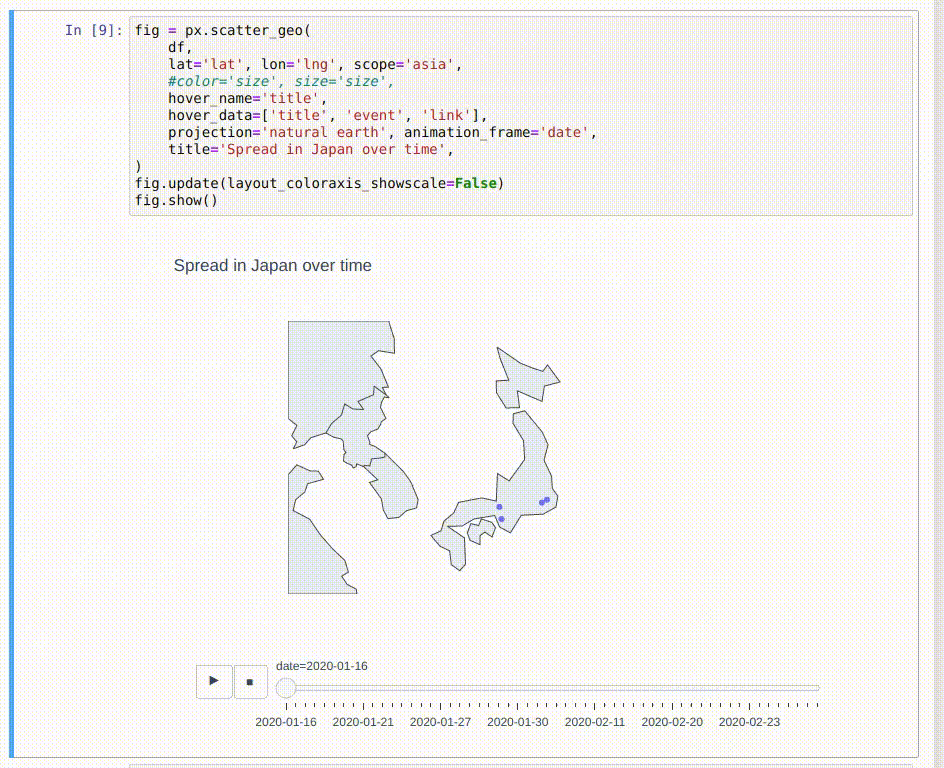

Jupyter Apps
============

Investigate what I can do with Jupyter.
You can check working notebooks by [binder](https://mybinder.org/v2/gh/hamasho/jupyter-apps/master).

## Apps

### Map/Spreadsheet Interactive Update

In this notebook, you can edit the spreadsheet and redraw the map
1. Change the content (LAT or LNG) of the sheet (ex. Fabbit Otemach's LAT 35.585 -> 35.500)
2. Redraw the map
3. Check the point is moved


### Best Office

This app is for finding the best office for weekly meeting in Tokyo.

1. Set up office info

| ID | NAME            | LAT       | LNG        |
|----|-----------------|-----------|------------|
| 1  | Fabbit Otemachi | 35.68457  | 139.769114 |
| 2  | Fabbit Ginza    | 35.674116 | 139.770548 |
| 3  | Fabbit Kyobashi | 35.679398 | 139.770954 |
| 4  | Fabbit Aoyama   | 35.672858 | 139.726335 |

2. Set up worker info

| ID | NAME             | LAT       | LNG        | 
|----|------------------|-----------|------------| 
| 1  | Shibuya Taro     | 35.670114 | 139.703467 | 
| 2  | Ueno Jiro        | 35.713456 | 139.777827 | 
| 3  | Shinagawa Saburo | 35.627137 | 139.737408 | 
| 4  | Toyosu Shiro     | 35.653881 | 139.796214 | 

3. By selecting attending workers and the office,
   the average commuting time, each worker's commuting time and
   all routes are displayed in realtime.


### Coronavirus

This app is for showing a timeseries of coronavirus cases' related events in Japan.

In Japan, we already have an excelent web portal [coromap.info](https://www.coromap.info/)
for coronavirus related information.
This site shows the statistics.
But the author always tries to catch up Japanese gov's latest information
and update the information.
Even though I can check this very up-to-date and complete information on the webpage,
I can't get structured information like JSON's event histories.

So I parsed this website and converted it into [JSON file](coronavirus_app/resources/events.json).
From this event history, I created a coronavirus related event time-lapse.



## Install

```sh
./scripts.sh init
```
